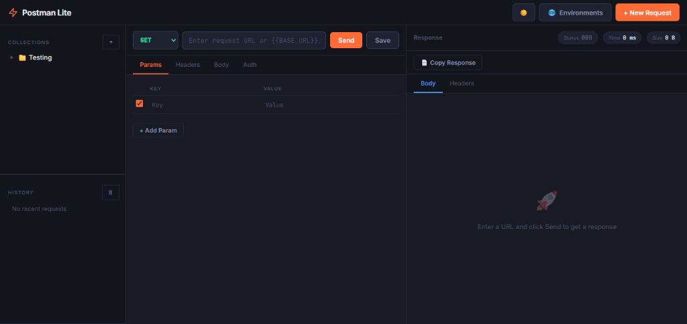
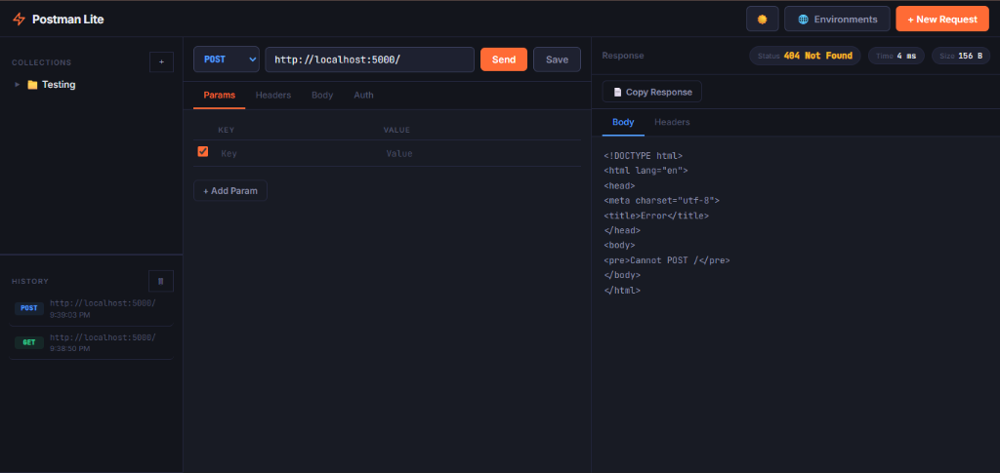
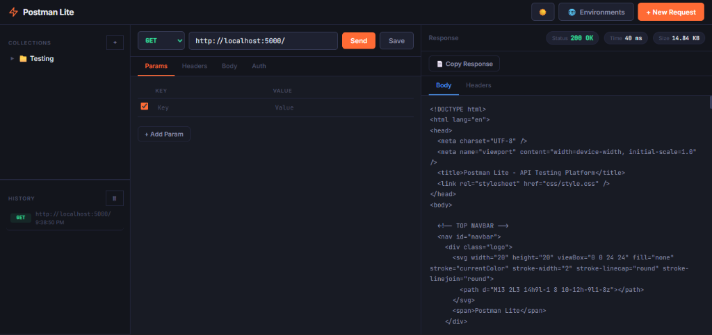
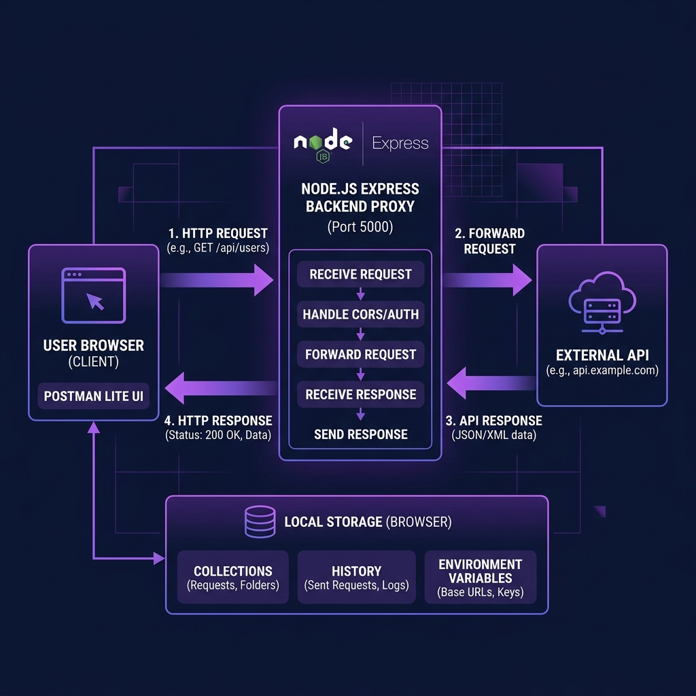

# ⚡ Postman Lite — API Testing Platform

> A lightweight, browser-based API testing tool built for the Hackathon. Test APIs, manage collections, set environment variables, and inspect responses — all without installing anything.

---

## 📌 Project Overview

**Postman Lite** is a full-stack API testing web application inspired by Postman. It allows developers to send HTTP requests (GET, POST, PUT, PATCH, DELETE) to any API endpoint, inspect responses with syntax highlighting, save requests in organized collections, and manage environment variables — all through a clean, premium dark-themed UI.

The backend acts as a **CORS proxy server**, allowing the frontend to call any external API without browser CORS restrictions.

All data (collections, history, environment variables) is stored in **browser localStorage** — no database required.

---

## ✨ Features

| Feature | Description |
|---|---|
| 🚀 **Send HTTP Requests** | Supports GET, POST, PUT, PATCH, DELETE, HEAD, OPTIONS |
| 📋 **Request Builder** | Set Params, Headers, Body (JSON / form-data / urlencoded / raw), and Auth |
| 🔐 **Authentication** | Bearer Token, Basic Auth, API Key support |
| 🌍 **Environment Variables** | Define `{{VARIABLE}}` placeholders, resolve them at runtime |
| 📁 **Collections** | Save, organize, and reload requests in named collections |
| 🕓 **Request History** | Automatically tracks the last 20 sent requests |
| 🎨 **JSON Syntax Highlighting** | Response body displayed with color-coded JSON |
| 🌙 **Dark / Light Mode** | Toggle between themes, persisted in localStorage |
| 📡 **CORS Proxy** | Backend proxy bypasses CORS restrictions transparently |
| 📊 **Response Meta** | Shows Status Code, Response Time (ms), and Size (KB) |

---

## 🗂️ Folder Structure

```
on_hackthone_project/
│
├── backend/                    # Node.js + Express backend
│   ├── routes/
│   │   └── proxy.js            # CORS proxy route using Axios
│   ├── server.js               # Express app entry point
│   └── package.json            # Backend dependencies
│
├── frontend/                   # Vanilla JS + HTML + CSS frontend
│   ├── css/
│   │   └── style.css           # Full premium dark theme styles
│   ├── js/
│   │   ├── app.js              # Main wiring, event listeners, history
│   │   ├── auth.js             # Auth header management (Bearer/Basic/API Key)
│   │   ├── collections.js      # Collection CRUD via localStorage
│   │   ├── environment.js      # Environment variable resolution ({{VAR}})
│   │   ├── request.js          # Request builder + fetch to proxy
│   │   └── response.js         # Response renderer + JSON syntax highlighter
│   └── index.html              # Main application shell
│
└── README.md                   # Project documentation
```

---

## 🛠️ Technologies Used

### Backend
| Technology | Purpose |
|---|---|
| **Node.js** | Runtime environment |
| **Express.js** | Web server and routing |
| **Axios** | Proxying HTTP requests to external APIs |
| **CORS** | Allowing frontend cross-origin requests |

### Frontend
| Technology | Purpose |
|---|---|
| **HTML5** | Application structure |
| **Vanilla CSS** | Full custom dark theme with glassmorphism |
| **Vanilla JavaScript** | All UI logic, no frameworks |
| **localStorage** | Persistent storage for collections, history, env vars |
| **Google Fonts** | Inter + JetBrains Mono for typography |

---

## 🚀 Installation & Setup

### Prerequisites
- [Node.js](https://nodejs.org/) v16 or higher
- npm (comes with Node.js)

### Step 1 — Clone the project
```bash
git clone <your-repo-url>
cd on_hackthone_project
```

### Step 2 — Install backend dependencies
```bash
cd backend
npm install
```

### Step 3 — Start the server
```bash
node server.js
```

You should see:
```
Server running at http://localhost:5000
```

### Step 4 — Open in browser
Navigate to:
```
http://localhost:5000
```

> ✅ The frontend is served automatically by Express from the `frontend/` folder. **No separate frontend server needed.**

---

## 🔄 Application Workflow

```
User fills URL + Method + Headers/Body/Auth
           │
           ▼
   Frontend (browser)
   js/request.js → resolves {{ENV_VARS}} → builds payload
           │
           ▼ POST http://localhost:5000/proxy
   Backend Proxy (Express)
   routes/proxy.js → Axios forwards request to External API
           │
           ▼
   External API responds
           │
           ▼
   Backend returns { status, headers, data, time, size }
           │
           ▼
   Frontend (js/response.js)
   → Renders JSON with syntax highlighting
   → Updates Status / Time / Size chips
   → Saves to History (localStorage)
```

---

## 💾 localStorage Data Structure

All app state is persisted using **browser localStorage** under these keys:

| Key | Contents |
|---|---|
| `pl_collections` | Array of collection objects with saved requests |
| `pl_history` | Array of last 20 sent requests |
| `pl_env` | Object of environment variable key-value pairs |
| `pl_theme` | `"dark"` or `"light"` for theme preference |

---

## 🎯 How to Use

### Sending a Request
1. Type or paste a URL in the URL bar (e.g., `https://jsonplaceholder.typicode.com/posts`)
2. Select an HTTP method from the dropdown (GET, POST, etc.)
3. Add optional **Params**, **Headers**, **Body**, or **Auth** from the tabs
4. Click the **Send** button (or press `Enter`)
5. View the response in the right panel

### Using Environment Variables
1. Click the **🌐 Environments** button in the navbar
2. Add variables like `BASE_URL = https://api.example.com`
3. Use them in your URL or headers: `{{BASE_URL}}/users`

### Saving to a Collection
1. Click the **💾 Save** button
2. Choose an existing collection or create a new one
3. The request appears in the left sidebar for quick reload

### Dark / Light Mode
- Click the ☀️/🌙 button in the navbar to toggle themes

---

## 📸 Screenshots

### 🌑 Dark Mode — Default View


---

### ☀️ Light Mode — Theme Toggle


---

### 📡 Response Viewer — Live API Response


---

### 🏗️ Application Architecture / Workflow


---

## 👨‍💻 Author

Built for the **Hackathon** — Postman Lite demonstrates a functional, real-world API client with a premium UI, zero external frontend dependencies, and a clean backend proxy architecture.

---

## 📄 License

This project is open source for educational and hackathon purposes.
